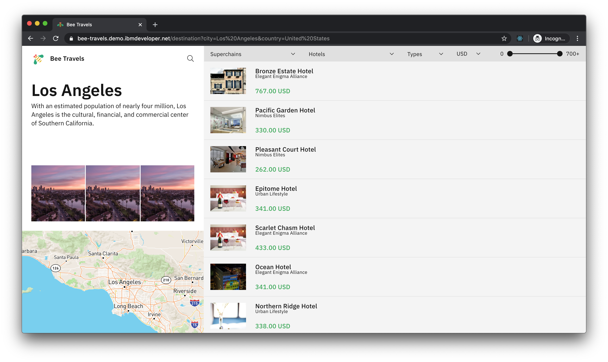
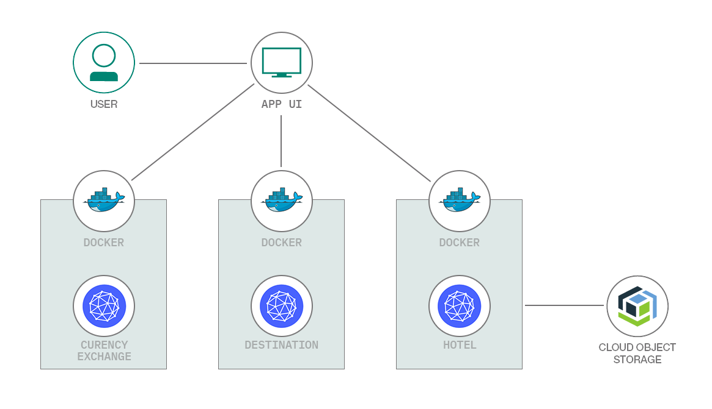

## What is Bee Travels: 
Bee Travels is a polyglot demo microservice application that is created to demonstrate key capabilities of Kubernetes, OpenShift ,Istio, Knative, and many other cloud-native technologies. 

Bee Travels uses best practices in the software development lifecycle and wildly used open source technologies. This application encompasses the full developer life cycle experience and is also written in recommended coding languages such as Node, Python, Rust, Go,and Java. 

## What you will learn: 
Follow this documentation if you like to use Bee Travels to learn more about : 

    - Microservice design
    - Deploying microservices
    - Testing and debugging microservices
    - Data Handling within microservices 
    - Connecting microservices to different services on IBM Cloud
    - Monitoring and logging microservices
    - Communication between microservices
    - CI/CD
    - Security

## Architecture:
Bee Travels is a travel booking application that is composed of several mircoservices. Each mircoservice can be run independently, or together to form the full service. Bee Travels can be used to search and book hotels, flights and car rentals for various destinations across the world.

> **Note:** All data is fake and only to be used for demonstration purposes.

Bee Travels is comprised of the following microservices:
* [UI Frontend](https://github.com/bee-travels/bee-travels-node/tree/master/services/ui/frontend)
* UI Backend
* Destination Service
* Hotel Service 
* Currency Exchange

The following is a basic architecture diagram for the containerized version of Bee Travels.

## Authors 
- Mofi Rahman 
- Max Shapiro 
- Nick Bourdakos 
- Pooja Mistry 